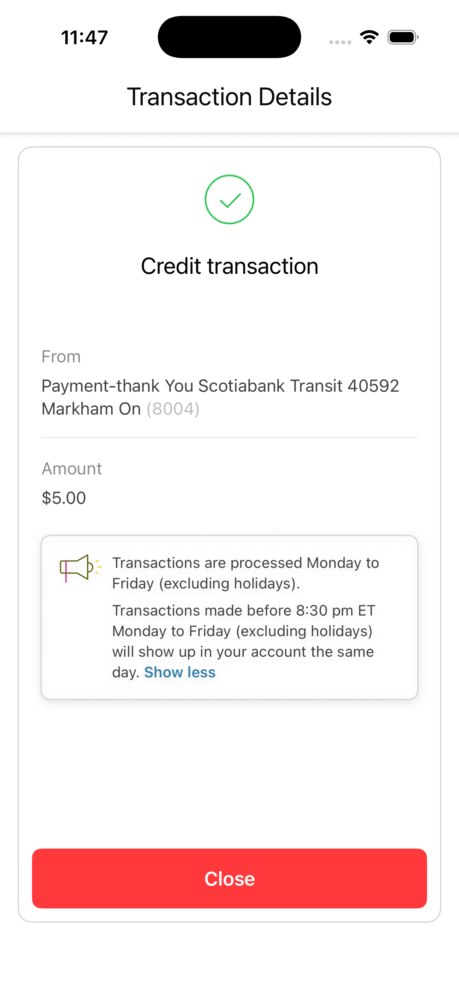

# TxApp — Scotiabank iOS Assessment

An iOS app that displays a list of credit card transactions and a transaction detail screen.

## Requirements

- Xcode 16+
- iOS 17+
- Swift 6

## Features

- **Transaction list** — loads 33 transactions from a bundled JSON file and displays merchant name, description, and amount
- **Transaction detail** — shows transaction type (Debit/Credit) with a colour-coded checkmark, account info, amount, and an expandable tooltip
- **Tooltip** — expands/collapses inline with a "Show more / Show less" toggle
- **Close button** — dismisses the detail screen and returns to the list

## Screenshots



## Architecture

The app uses [The Composable Architecture (TCA)](https://github.com/pointfreeco/swift-composable-architecture) by Point-Free.

Each screen is a self-contained **feature** with its own `State`, `Action`, and `Reducer`. Navigation and child feature lifecycle are managed by the parent reducer via TCA's `@Presents` / `PresentationAction` pattern.

```
TxApp/
├── TxApp.swift                              # @main entry point
├── Features/
│   └── TransactionList/
│       ├── TransactionListFeature.swift     # List reducer (load, navigate to detail)
│       ├── TransactionListView.swift        # List + row views
│       ├── TransactionDetailFeature.swift   # Detail reducer (tooltip toggle, close)
│       └── TransactionDetailView.swift      # Detail, tooltip, and row subviews
├── Client/
│   ├── TransactionClient.swift             # Async data-fetching interface
│   └── TransactionClient+Dependencies.swift # TCA DependencyKey registration
└── Models/
    ├── Transaction.swift                   # Transaction, Amount, TransactionType + mock
    └── Amount+Formatting.swift             # Currency display helper
```

### Key design decisions

- **`TransactionClient` as a TCA dependency** — the client is injected via `@Dependency`, making it trivially swappable in tests without any mocking framework.
- **`TransactionType` as an enum** — rather than a raw `String`, this makes exhaustive handling of DEBIT/CREDIT compile-safe.
- **`Amount.value` as `Decimal`** — avoids floating-point rounding errors common with `Double` for currency values.
- **`postedDate` as `Date`** — decoded at the boundary so the rest of the app works with a typed value rather than a string.
- **`TooltipView` as a pure SwiftUI component** — receives an `@Binding` so its expand/collapse state lives in the TCA store and is fully testable.
- **`reduce(into:action:)` directly on `TransactionListFeature`** — works around a Swift 6.2 / Xcode 26 compiler bug that causes infinite recursion in the `Reducer` protocol's default `_reduce` dispatch when using the `body` property.

## Tests

Tests use Swift's native `Testing` framework alongside TCA's `TestStore`.

| File | What's covered |
|---|---|
| `TransactionClientTests` | Live client loads 33 transactions from disk; test value returns mock |
| `TransactionListFeatureTests` | `onAppear` loads transactions; error state; skips refetch when already loaded; tapping a transaction presents detail; close dismisses detail; tooltip toggle updates state |

## What I'd do next with more time

- **Transaction list grouping** — group rows by posted date with section headers
- **Formatted date display** — render `postedDate` as a human-readable string in both the list and detail views
- **`fromAccount` on detail** — the design shows the account name in the "From" field; currently `merchantName` is used as a stand-in
- **Accessibility** — add `accessibilityLabel` and `accessibilityHint` to interactive elements; audit Dynamic Type scaling
- **Snapshot tests** — add snapshot tests for `TransactionListView` and `TransactionDetailView` to catch unintended UI regressions
- **Error recovery** — add a retry button on the error state in the list view
- **CI** — add a GitHub Actions workflow to run the test suite on every push
